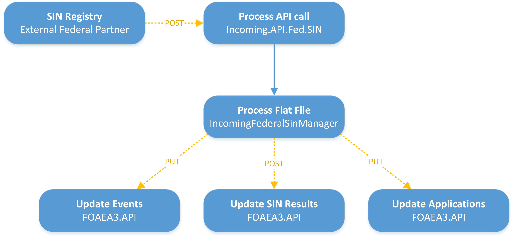
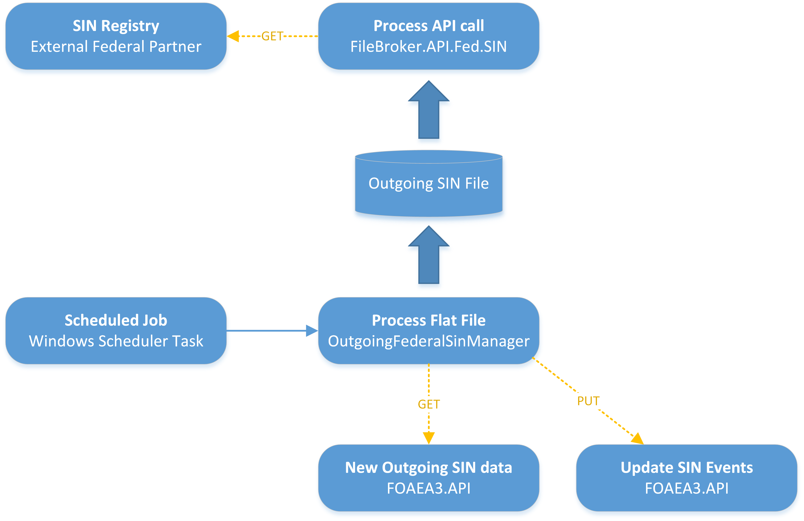

# Processing Federal SIN Files
The following processes uses the same files currently being exchanged with the SIN Registry, in the same format. Future updates may add different formats or allow individual requests rather than the current batch system.
## Incoming Federal SIN Files
1.	External partner calls our API to send us their file: 

    `POST https://{server}:14015/api/v1/SinFiles?fileName=HR3SVSIS.{nnn}`

    * **Important:** The **body** of the API must contain the flatfile in the same format that we currently receive.
    * `{server}` will be our server name available to external users
    * `{nnn}` will be the next sequence that we are expecting (e.g. 123)
The `ProcessSINFile()` method of the `SinFilesController` class found in the `FileBroker.API.Fed.SIN` project is called via that API.
1.	`ProcessSINFile()` will call the `ProcessFlatFile()` method of the `IncomingFederalSinManager` class found in the `FileBroker.Business` project. `ProcessFlatFile()` will load the flat file, extract it’s data, and call APIs to update the FOAEA system with the new data:
    1.	Set the File Loading flag in the `FileTable` in the Message Broker database
    1.	Extract the flat file data
    1.	Validate the flat file data
    1.	Extract business data from the flat file
    1.	Send the SIN results to the FOAEA database by called FOAEA APIs:
        1.	Update the SIN Events and Event Details tables
        1.	Update the SIN Results table
        1.	Update the applications based on the SIN results (either the SIN was confirmed or it was not – the state of the matching application will change to 6 if it was confirmed or to 5 if it was not).
    1.	Change the cycle to the next increment expected
    1.	Reset the File Loading flag in the `FileTable` in the Message Broker database

   

## Outgoing Federal SIN Files
1.	A new SIN outgoing file will get created when the Windows Task Scheduler calls the `Outgoing.FileCreator.Fed.SIN` command line tool.
1.	The `Outgoing.FileCreator.Fed.SIN` command line tool will call the `CreateOutputFile()` method of the `OutgoingFederalSinManager` class found in the `FileBroker.Business` project.
1.	`CreateOutputFile()` will do the following:
    1.  call an API to get the new SIN data from the FOAEA system
    1.  create the outgoing SIN file with the proper cycle and store it in the location defined in the Message Broker `FileTable`
    1.  update the `OutboundFileTable` in the Message Broker
    1.  set the cycle to the new cycle in the Message Broker `FileTable`
    5.  call an API to update the outbound SIN events in the FOAEA system
1.	External partners will call our API to get the latest file:

    `GET https://{server}:14015/api/v1/SinFiles`

     *An alternative would be for the SIN Registry to have an API available that we can call to send them the newly generated file.*

    
